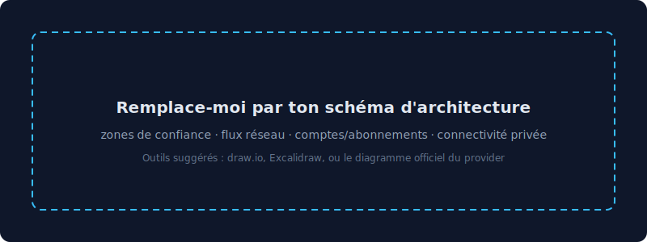

# Secure Multi-Cloud Landing Zone

> Socle de plateforme cloud durci **par design**, déployé 100 % en Infrastructure-as-Code, avec une architecture réseau **Zero Trust**, une identité fédérée **sans clé statique**, du chiffrement géré, un audit infalsifiable, et un pipeline de déploiement **GitOps** à gates de sécurité bloquants.


-success)


---

## Le problème

La plupart des environnements cloud sont montés à la main : IAM trop permissif, réseaux à plat exposés, logging partiel, dérive de configuration impossible à auditer, et des clés d'accès longue durée qui traînent dans les secrets du CI. Ce projet répond à une question simple : **« comment poser, en une commande et de façon reproductible, des fondations cloud que je peux prouver conformes — et les faire évoluer sans jamais cliquer dans une console ? »**

## Architecture



Defense in depth, du périmètre vers le cœur : chaque couche ferme un chemin d'attaque. Le schéma distingue ce qui est **déployé** (Projet 1) de ce qui est **prévu** (Projets 2-4). Le détail du raisonnement menace → contrôle est dans [`THREAT_MODEL.md`](THREAT_MODEL.md).

## Ce que ce projet démontre

| Capacité | Mise en œuvre |
|---|---|
| **Réseau Zero Trust** | VPC segmenté en 3 tiers × 2 AZ ; tier data **sans route Internet** (isolation par construction) ; micro-segmentation par SG référencés entre eux ; connectivité privée par VPC endpoints. |
| **Identité = périmètre** | Fédération OIDC GitHub↔AWS : **zéro clé statique** ; rôles `plan` (lecture) / `apply` (écriture) séparés, scopés au repo et à la branche. |
| **Protection des données** | Clé KMS gérée avec rotation ; chiffrement au repos et en transit ; secrets jamais en clair (gitleaks en CI). |
| **Audit & conformité** | CloudTrail multi-région avec validation d'intégrité ; VPC Flow Logs ; règles AWS Config pour la détection de dérive. |
| **DevSecOps** | Pipeline GitOps : `plan` commenté sur les PR, `apply` au merge derrière approbation, gates de sécurité **bloquants** (Checkov, tfsec, gitleaks, OPA). |
| **Reproductibilité** | Tout en Terraform modulaire, state distant chiffré avec verrouillage natif S3, déploiement en une commande. |

## Résultats & posture mesurés

| Indicateur | Valeur |
|---|---|
| Findings critiques Checkov sur `main` | **0** — gates bloquants : toute PR introduisant une misconfig est rejetée avant le merge |
| Checks Checkov passés (IaC) | **221** checks passés, 27 risques acceptés et documentés (`#checkov:skip`) |
| Clés statiques dans le CI | **0** — authentification 100 % OIDC (rôles éphémères, pas de `AWS_ACCESS_KEY_ID`) |
| Routes Internet sur le tier data | **0** — isolation prouvée par absence de route, pas par firewall contournable |
| Validation d'intégrité des logs d'audit | **activée** — CloudTrail multi-région, `enable_log_file_validation = true` |
| Rotation automatique de la clé KMS | **activée** — `enable_key_rotation = true` |
| Règles de conformité évaluées en continu (AWS Config) | **3** règles actives : `s3-public-read-prohibited`, `cloudtrail-enabled`, `iam-password-policy` |
| Trafic vers services AWS via endpoints privés | À mesurer — VPC Endpoints non déployés en v1.0 |
| Temps de reproduction du socle | À mesurer au prochain `terraform apply` |

## Reproduire en une commande

```bash
# Pré-requis : Terraform >= 1.11, credentials cloud en variables d'env
make init      # backend distant chiffré + verrouillage natif S3
make scan      # Checkov + tfsec + Gitleaks + OPA (bloquant)
make plan
make apply
make destroy   # nettoyage complet
```

## Structure du repo

```
.
├── bootstrap/              # backend de state (S3 chiffré, à appliquer une fois)
├── terraform/
│   ├── providers.tf        # backend S3 + use_lockfile, providers multi-cloud
│   ├── modules/
│   │   ├── network/        # VPC, segmentation 3 tiers, NACL/SG, endpoints, flow logs
│   │   ├── iam-baseline/   # password policy, OIDC, rôles plan/apply
│   │   └── security-baseline/  # KMS, CloudTrail, Config
│   └── environments/prod/
├── policies/opa/           # garde-fous policy-as-code (Rego)
├── .github/workflows/      # CI : scans bloquants + plan/apply GitOps via OIDC
├── docs/                   # schéma d'architecture
└── THREAT_MODEL.md         # modèle de menace (STRIDE + chemins d'attaque)
```

## Décisions de sécurité (le « pourquoi »)

| Décision | Justification |
|---|---|
| Tier data sans route `0.0.0.0/0` | L'isolation se prouve par l'absence de route, pas par un firewall contournable. |
| Pas d'ingress public sur les SG | Zero Trust : tout flux entrant est nommé et justifié. |
| OIDC plutôt que clés statiques | Supprime la cause n°1 d'incidents cloud : un secret long-terme qui fuite. |
| Rôles `plan`/`apply` séparés | Le pouvoir de modifier l'infra est réservé au code revu et fusionné. |
| `kms:*` au root dans la key policy | Garde-fou anti-lockout standard : ne donne aucun droit direct, délègue à IAM. |
| Validation d'intégrité CloudTrail | Tamper-evidence : prouver qu'aucune trace n'a été altérée après incident. |

## Stack & outils

Terraform · AWS (VPC, IAM, KMS, CloudTrail, Config, S3) · Azure _(parité en cours)_ · GitHub Actions · OIDC · Checkov · tfsec · Gitleaks · Conftest/OPA · référentiels CIS Benchmarks, AWS Well-Architected (pilier Sécurité), NIST SP 800-207.

## Place dans un portfolio plus large

Ce projet est le **socle** (« construire sûr ») d'un parcours en 4 volets : pipeline DevSecOps applicatif, durcissement Kubernetes + détection runtime, et CSPM + détection/réponse automatisée.

## Ce que je durcirais pour la production

Architecture multi-comptes (AWS Organizations) pour une isolation plus forte ; resserrement continu du moindre privilège du rôle `apply` (permissions boundary) ; détection temps réel et auto-remédiation (objet d'un projet dédié) ; NAT par AZ pour la haute disponibilité. _Énoncer ces limites fait partie de la démonstration._

## Licence

MIT
